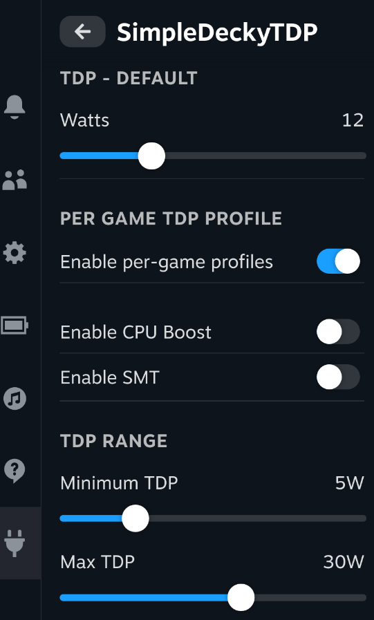

# SimpleDeckyTDP

This is a very simple Linux TDP Decky Plugin that wraps ryzenadj



## Requirements

### WARNING: This plugin assumes you already have ryzenadj installed and can be located in your PATH

To check this, you can run `which ryzenadj` in a terminal/console, which should print out a path to a ryzenadj binary.

e.g.

```
$ which ryzenadj
/usr/bin/ryzenadj
```

If not have ryzenadj installed, you will need to get a working copy installed onto your machine.

To test your ryzenadj to make sure that it's functional, run the following:

```
$ sudo ryzenadj -i
```

This should print out a table that looks something like the following:

```
CPU Family: Rembrandt
SMU BIOS Interface Version: 18
Version: v0.13.0 
PM Table Version: 450005
|        Name         |   Value   |     Parameter      |
|---------------------|-----------|--------------------|
| STAPM LIMIT         |     8.000 | stapm-limit        |
| STAPM VALUE         |     0.062 |                    |
```

If you see an error, you may need to set `iomem=relaxed` as a boot parameter for your machine.

## Dependencies:

- Node.js v16.14+ and pnpm installed
- fully functional ryzenadj

## Manual build + install

```bash
git clone https://github.com/aarron-lee/SimpleDeckyTDP.git

cd SimpleDeckyTDP

# if pnpm not already installed
npm install -g pnpm

pnpm install
pnpm update decky-frontend-lib --latest
pnpm run build
```

Afterwards, you can place the entire `SimpleDeckyTDP` folder in the `~/homebrew/plugins` directly, then restart your plugin service

```bash
sudo systemctl restart plugin_loader.service

sudo systemctl reboot
```

#### Other important information

Everytime you change the frontend code (`index.tsx` etc) you will need to rebuild using the commands from step 2 above or the build task if you're using vscode or a derivative.

Note: If you are receiving build errors due to an out of date library, you should run this command inside of your repository:

```bash
pnpm update decky-frontend-lib --latest
```

### Backend support

If you are developing with a backend for a plugin and would like to submit it to the [decky-plugin-database](https://github.com/SteamDeckHomebrew/decky-plugin-database) you will need to have all backend code located in ``backend/src``, with backend being located in the root of your git repository.
When building your plugin, the source code will be built and any finished binary or binaries will be output to ``backend/out`` (which is created during CI.)
If your buildscript, makefile or any other build method does not place the binary files in the ``backend/out`` directory they will not be properly picked up during CI and your plugin will not have the required binaries included for distribution.

Example:  
In our makefile used to demonstrate the CI process of building and distributing a plugin backend, note that the makefile explicitly creates the `out` folder (``backend/out``) and then compiles the binary into that folder. Here's the relevant snippet.

```make
hello:
	mkdir -p ./out
	gcc -o ./out/hello ./src/main.c
```

The CI does create the `out` folder itself but we recommend creating it yourself if possible during your build process to ensure the build process goes smoothly.

Note: When locally building your plugin it will be placed into a folder called 'out' this is different from the concept described above.

The out folder is not sent to the final plugin, but is then put into a ``bin`` folder which is found at the root of the plugin's directory.  
More information on the bin folder can be found below in the distribution section below.

### Distribution

We recommend following the instructions found in the [decky-plugin-database](https://github.com/SteamDeckHomebrew/decky-plugin-database) on how to get your plugin up on the plugin store. This is the best way to get your plugin in front of users.
You can also choose to do distribution via a zip file containing the needed files, if that zip file is uploaded to a URL it can then be downloaded and installed via decky-loader.

**NOTE: We do not currently have a method to install from a downloaded zip file in "game-mode" due to lack of a usable file-picking dialog.**

Layout of a plugin zip ready for distribution:
```
pluginname-v1.0.0.zip (version number is optional but recommended for users sake)
   |
   pluginname/ <directory>
   |  |  |
   |  |  bin/ <directory> (optional)
   |  |     |
   |  |     binary (optional)
   |  |
   |  dist/ <directory> [required]
   |      |
   |      index.js [required]
   | 
   package.json [required]
   plugin.json [required]
   main.py {required if you are using the python backend of decky-loader: serverAPI}
   README.md (optional but recommended)
   LICENSE(.md) [required, filename should be roughly similar, suffix not needed]
```

Note regarding licenses: Including a license is required for the plugin store if your chosen license requires the license to be included alongside usage of source-code/binaries!

Standard procedure for licenses is to have your chosen license at the top of the file, and to leave the original license for the plugin-template at the bottom. If this is not the case on submission to the plugin database, you will be asked to fix this discrepancy.

We cannot and will not distribute your plugin on the Plugin Store if it's license requires it's inclusion but you have not included a license to be re-distributed with your plugin in the root of your git repository.
